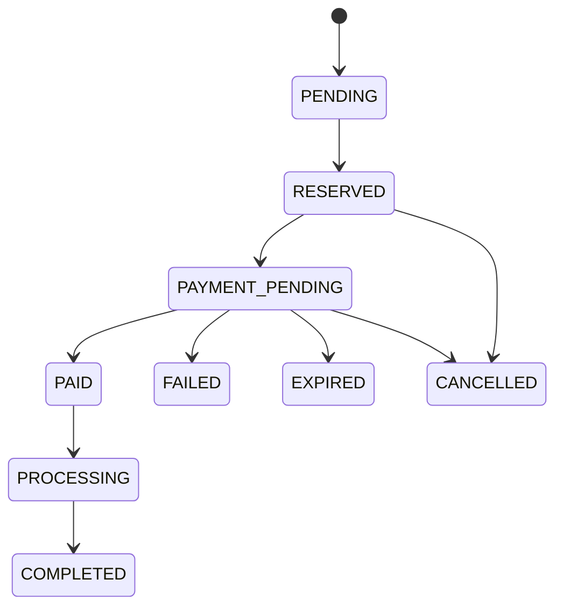

# Order Lifecycle

Invalid transitions return `409 Conflict`. Active reservations are released when an order is cancelled. Completed orders cannot be cancelled. Every transition is recorded in `OrderStatusHistory`.
